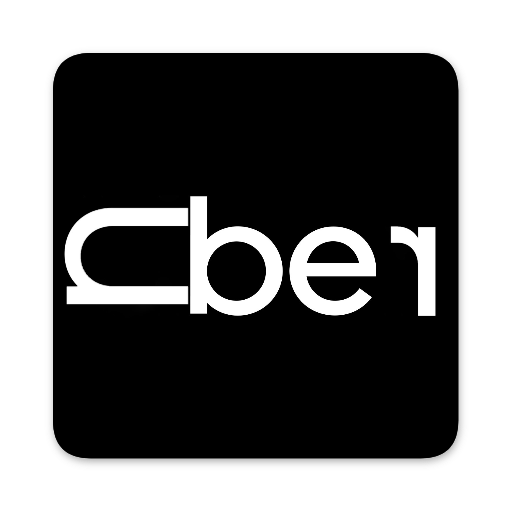
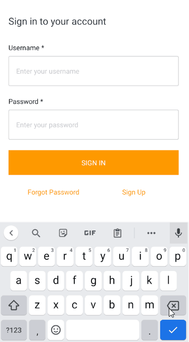
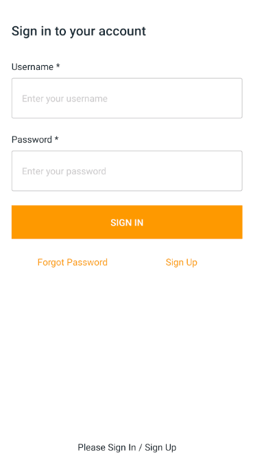

<!-- PROJECT LOGO -->
<br />
<p align="center">
  <a href="https://github.com/Waiikiin/react-native-UberClone">
    
    
  </a>

  <h3 align="center">Uber Clone</h3>

  <p align="center">
    Clones of the popular Uber App implemented in react native
    <br />
    `</strong></a>
    <br />
    <br />
    <a href="https://github.com/Waiikiin/react-native-UberClone">View Demo</a>
    ·
    <a href="https://github.com/Waiikiin/react-native-UberClone">Report Bug</a>
    ·
    <a href="https://github.com/Waiikiin/react-native-UberClone">Request Feature</a>
  </p>
</p>


<!-- TABLE OF CONTENTS -->
<details open="open">
  <summary><h2 style="display: inline-block">Table of Contents</h2></summary>
  <ol>
    <li>
      <a href="#about-the-project">About The Project</a>
      <ul>
        <li><a href="#built-with">Built With</a></li>
      </ul>
    </li>
    <li>
      <a href="#getting-started">Getting Started</a>
      <ul>
        <li><a href="#prerequisites">Prerequisites</a></li>
        <li><a href="#installation">Installation</a></li>
      </ul>
    </li>
    <li><a href="#usage">Usage</a></li>
    <li><a href="#contact">Contact</a></li>
    <li><a href="#acknowledgements">Acknowledgements</a></li>
  </ol>
</details>


<!-- ABOUT THE PROJECT -->
## About The Project

<a align="center">
  
  
</a>


These are clones of the popular Uber App and Uber Driver App implemented in react native. It contains the core features that the real Uber app has.

I started this project to learn more about react-native and its paradigm. Features like navigation, search autocomplete, google maps, etc. are implemented in the app to make it look more like the real Uber App. To make the app more interactive, I implemented the backend using AWS Amplify to replace most dummy data in the app. 

### Built With

* [react](https://reactjs.org/)
* [react native](https://reactnative.dev/)
* [react-native-maps](https://github.com/react-native-maps/react-native-maps)
* [react-native-maps-directions](react-native-maps-directions)
* [react-native-community/geolocation](https://github.com/react-native-geolocation/react-native-geolocation)
* [react-navigation](https://reactnavigation.org/)
* [react-native-google-places-autocomplete](https://www.npmjs.com/package/react-native-google-places-autocomplete)
* [aws-amplify](https://aws.amazon.com/amplify/)
* [amazon-cognito](https://aws.amazon.com/cognito/)


<!-- GETTING STARTED -->
## Getting Started

You can either install this in your local machine manually or you can use the table or content to jump to Usage to see the developed features of the app.

Since the app is still under developement, there will be some changes that might lead to mismatch bewteen the app featues and the documentation, therefore it is recommended to just jump to Usage to see the app.

### Prerequisites

Make sure your node version is >= 12

Your react native development environment is all set up

You need a google API key, if you don't have one, please visit [this website](https://support.google.com/googleapi/answer/6158862?hl=en) to get your API key


* npm
  ```sh
  npm install npm@latest -g
  ```

### Installation

1. Clone the repo
   ```sh
   git clone https://github.com/github_username/repo_name.git
   ```
2. cd into the app folder that you want to run
3. Install NPM packages
    ```sh
    npm install
    ```
    if you have ios

    ```sh
    cd ios && pod install && cd ..
    ```
4. Open .env_template and put your API key in there
5. Rename the file .env_template to .env
6. For android
    ```sh
    npm run android or yarn android
    ```
7. For ios 
    ```sh
    npm run ios or yarn ios
    ```

<!-- CONTACT -->
## Contact

LinkedIn - [https://www.linkedin.com/in/wai-kin-leong-8a4a51170](https://www.linkedin.com/in/wai-kin-leong-8a4a51170) 


<!-- ACKNOWLEDGEMENTS -->
## Acknowledgements

* [notjust.dev](https://www.notjust.dev/)
* [othneildrew](https://github.com/othneildrew/Best-README-Template)


<!-- MARKDOWN LINKS & IMAGES -->
[UserApp-screenshot]: images/UserApp.gif
[DriverApp-screenshot]: images/DriverApp.gif
